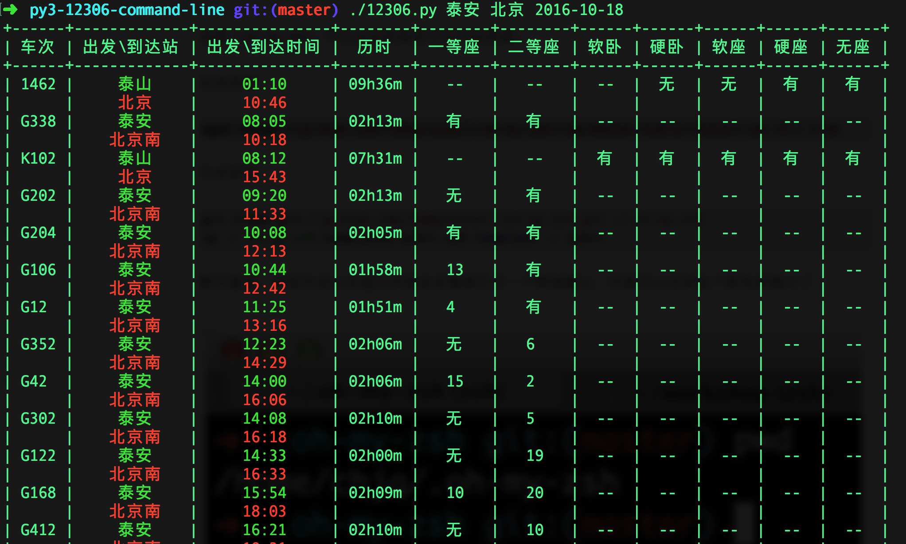

# py3-12306-command-line
12306命令行查询火车票工具

## python版本

python3.5

## 用到的库

sudo pip3 install requests prettytable docopt

## 运行

sudo chmod +x 12306.py

./12306.py 泰安 北京 2016-10-17

## 效果图

## 相关知识

### python设置文字输出颜色

 格式：\033[显示方式;前景色;背景色m

说明：

| 前景色  |    背景色    |  颜色 |
| :-----:|  :------:   | :-----: |
| 30     |  40        |  黑色    | 
| 31     |  41        |  红色  |
| 32     |  42        |  绿色  |
| 33     |  43        |  黃色  |
| 34     |  44        |  蓝色  |
| 35     |  45        |  紫红色|
| 36     |  46        |  青蓝色|
| 37     |  47        |  白色  |

|显示方式 | 意义         |
| :-----:|  :------:   |
|0       | 终端默认设置  |
|1       | 高亮显示      |
|4       | 使用下划线    |
|5       | 闪烁         |
|7       | 反白显示      |
|8       | 不可见        |

例子：

\033[1;31;40m    1-高亮显示 31-前景色红色  40-背景色黑色

\033[0m          采用终端默认设置，即取消颜色设置

## 备注

12306的查票接口URL经常变，发现代码查询失败，就要去12306抓下包，看看的新的URL是什么。

